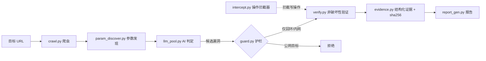

# 架构 · Architecture

```mermaid
flowchart LR
  T[目标 URL] --> C[crawl.py 爬虫]
  C --> P[param_discover.py 参数发现]
  P --> L[llm_pool.py AI 判定]
  L -->|候选漏洞| G{guard.py 护栏}
  G -->|仅回环/内网| V[verify.py 非破坏性验证]
  G -->|公网目标| X[拒绝]
  V --> E[evidence.py 结构化证据 + sha256]
  E --> R[report_gen.py 报告]
  I[intercept.py 操作拦截器] -.拦截写操作.-> V
```

**三条禁令**（写死在 intercept.py）：不改数据、不爆破、默认只读。

**证据**：阳性与阴性都落盘，逐条 sha256，可追溯可复核。

